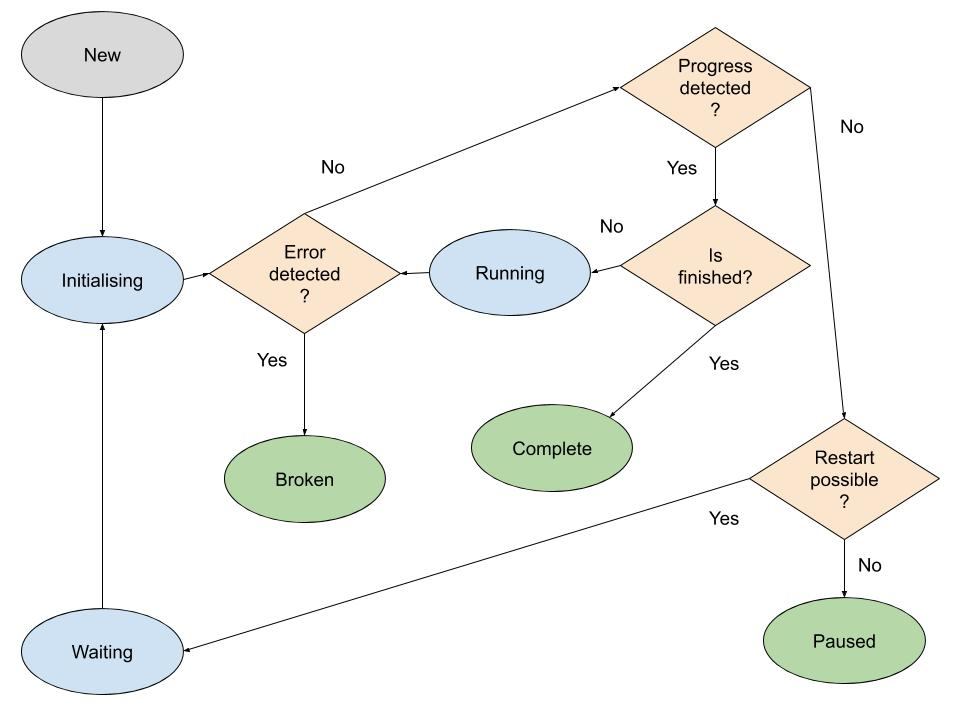

# Overview

## Setting up cronjob

Install the cronjob needed to manage all the jobs within the system. It is best to have this execute as the
same user as your webserver - this prevents any problems with file permissions.

```bash
*/1 * * * * /path/to/silverstripe/vendor/bin/sake dev/tasks/ProcessJobQueueTask
```

To test things are working, run the following command to create a dummy task

```bash
vendor/bin/sake dev/tasks/CreateQueuedJobTask 
```

Every job is tracked as a database record, through [`QueuedJobDescriptor`](api:Symbiote\QueuedJobs\DataObjects\QueuedJobDescriptor) objects.
This means jobs can also be managed via the CMS.
Open up `/admin/queuedjobs` in a browser.
You should see the new job with `Status=New`.
Now either wait for your cron to execute, or trigger execution manually.

```bash
vendor/bin/sake dev/tasks/ProcessJobQueueTask 
```

The job should now be marked with `Status=Completed`.

## Triggering jobs

```php
use Symbiote\QueuedJobs\Jobs\PublishItemsJob;
use Symbiote\QueuedJobs\Services\QueuedJobService;

$publish = new PublishItemsJob(21);
QueuedJobService::singleton()->queueJob($publish);
```

To schedule a job to be executed at some point in the future, pass a date through with the call to `queueJob()`

```php
use Symbiote\QueuedJobs\Jobs\PublishItemsJob;
use Symbiote\QueuedJobs\Services\QueuedJobService;

// Runs a day from now
$publish = new PublishItemsJob(21);
QueuedJobService::singleton()->queueJob($publish, date('Y-m-d H:i:s', time() + 86400));
```

## Defining jobs

Jobs are just PHP classes. They are stored as database records,
and can have different states, as well as multiple steps.
See [Defining Jobs](./02_defining-jobs.md) for more information.

## Choosing a runner

The default runner [`QueueRunner`](api:Symbiote\QueuedJobs\Tasks\Engines\QueueRunner)
for queued (rather than immediate) jobs
will pick up one job every time it executes. Since that usually happens through
a cron task, and crons can only run once per minute,
this is quite limiting.

The modules comes with more advanced approaches to speed up queues:

- [Doorman](./06_configuring-runners.md#doorman): Spawns child PHP processes. Does not have any system dependencies.
- [Gearman](./06_configuring-runners.md#gearman): Triggered through a `gearmand` system process

## Cleaning up job entries {#cleaning-up}

Every job is a database record, and this table can fill up fast!
While it's great to have a record of when and how each job has run,
this can lead to delays in reading and writing from the `QueuedJobDescriptor` table.
The module has an optional [`CleanupJob`](api:Symbiote\QueuedJobs\Jobs\CleanupJob) for this purpose. You can enable
it through your config:

```yml
Symbiote\QueuedJobs\Jobs\CleanupJob:
  is_enabled: true
```

You will need to trigger the first run manually in the UI. After that the CleanupJob is run once a day.

You can configure this job to clean up based on the number of jobs, or the age of the jobs. This is
configured with the [`CleanupJob.cleanup_method`](api:Symbiote\QueuedJobs\Jobs\CleanupJob->cleanup_method) setting - current valid values are "age" (default)  and "number".
Each of these methods will have a value associated with it - this is an integer, set with [`CleanupJob.cleanup_value`](api:Symbiote\QueuedJobs\Jobs\CleanupJob->cleanup_value).
For "age", this will be converted into days; for "number", it is the minimum number of records to keep, sorted by LastEdited.
The default value is 30, as we are expecting days.

You can determine which JobStatuses are allowed to be cleaned up. The default setting is to clean up "Broken" and "Complete" jobs. All other statuses can be configured with [`CleanupJob.cleanup_statuses`](api:Symbiote\QueuedJobs\Jobs\CleanupJob->cleanup_statuses). You can also define [`CleanupJob.query_limit`](api:Symbiote\QueuedJobs\Jobs\CleanupJob->query_limit) to limit the number of rows queried/deleted by the cleanup job (defaults to 100k).

The default configuration looks like this:

```yml
Symbiote\QueuedJobs\Jobs\CleanupJob:
  is_enabled: false
  query_limit: 100000
  cleanup_method: "age"
  cleanup_value: 30
  cleanup_statuses:
    - Broken
    - Complete
```

## Long-running jobs

If your code is to make use of the 'long' jobs, ie that could take days to process, also install another task
that processes this queue. Its time of execution can be left a little longer.

```bash
*/15 * * * * /path/to/silverstripe/vendor/bin/sake dev/tasks/ProcessJobQueueTask queue=large
```

From your code, add a new job for execution.

```php
use Symbiote\QueuedJobs\Jobs\PublishItemsJob;
use Symbiote\QueuedJobs\Services\QueuedJobService;

$publish = new PublishItemsJob(21);
QueuedJobService::singleton()->queueJob($publish);
```

To schedule a job to be executed at some point in the future, pass a date through with the call to queueJob
The following will run the publish job in 1 day's time from now.

```php
use SilverStripe\ORM\FieldType\DBDatetime;
use Symbiote\QueuedJobs\Jobs\PublishItemsJob;
use Symbiote\QueuedJobs\Services\QueuedJobService;

$publish = new PublishItemsJob(21);
QueuedJobService::singleton()
    ->queueJob($publish, DBDatetime::create()->setValue(DBDatetime::now()->getTimestamp() + 86400)->Rfc2822());
```

## Immediate jobs

Jobs can be declare to run "immediately", rather than being queued.
What that means in practice depends on your configuration.

By default, these jobs are run on PHP shutdown,
in the same process which queued the job
(see [`QueuedJobService.use_shutdown_function`](api:Symbiote\QueuedJobs\Services\QueuedJobService->use_shutdown_function)).
Code run after shutdown does not affect the response to the requesting client,
but does continue to consume resources on the server.
In a worker-based environment such as Apache or Nginx,
this can have side effects on request processing.

So while this is the easiest setup (zero config or system dependencies),
there are more robust alternatives:

- [inotifywait](./04_immediate-jobs.md#inotifywait): Works based on watching files. Useful for immediate jobs.
- [lsyncd](./04_immediate-jobs#lsyncd): Alternative based on watching files.

## Logging and error reporting

Just like any other code in Silverstripe, jobs can create log entries and errors.
You should use the global `LoggerInterface` singleton
as outlined in the [framework docs on error handling](https://docs.silverstripe.org/en/developer_guides/debugging/error_handling/).

Any log handlers which are configured within your application
(e.g. services like Sentry or Raygun) will also pick up logging
within your jobs, to the reporting level you've specified for them.

Additionally, messages handled through `LoggerInterface`
as well as an exceptions thrown in a job will be logged
to the database record for the job in the `QueuedJobDescriptor.SavedJobMessages`
column. This makes it easier to associate messages to specific job runs,
particularly when running multiple jobs concurrently.

Immediate jobs run through [`ProcessJobQueueTask`](api:Symbiote\QueuedJobs\Tasks\ProcessJobQueueTask) will also
log to stderr and stdout when run through the command-line (incl. cron execution).  
Queued jobs run this way may not log consistently to stdout and stderr,
see [Troubleshooting](troubleshooting)

## Default jobs

Some jobs should always be either running or queued to run, things like data refreshes or periodic clean up jobs, we call these Default Jobs.
See [Default Jobs](./03_default-jobs.md) for information on how to
disable or pause these jobs.

## Job states

It's really useful to understand how job state changes during the job lifespan as it makes troubleshooting easier. The following chart shows the whole job lifecycle:



### Notes

- every job starts in `New` state
- every job should eventually reach either `Complete`, `Broken` or `Paused`
- `Cancelled` state is not listed here as the queue runner will never transition job to that state as it is reserved for user triggered actions
- progress indication is either state change or step increment
- every job can be restarted however there is a limit on how many times (see `stall_threshold` config)
